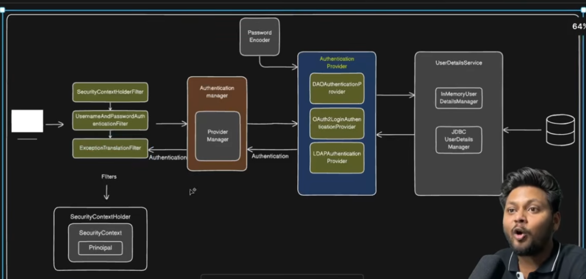

Spring Security
Authentication: Verify legitimate user
Authorization: Determine what you can do after authentication

1. add spring-boot-starter-security to pom.xml
when app started, a password is generated for development purposes. we are redirected to /login. username = user
behind scene: Servlet API lifecycle (before Spring app context) has the filter chain
the added dependency adds SecurityFilterChain to the chain
2. DelegatingFilterProxy bridges the two lifecycles lives in Servlet API, has FilterChainProxy which has the SFC
3. In production, instead of generated pw/name, we'd use either pw's stored in DB/memory,
4. OR OAuth2 
5. The SFC itself has multiple SecurityFilter to be aware of
6. in the spring security default login case, We call login/pw a Form based authentication, its filter is UsernamePasswordAuthenticationFilter

Notice how Spring Security doesnt mix with OAuth2 (like the login filter)
Thus Spring provides Authentication Provider, for example OAuth2Login<> or DAO<>, LDAP<>, JWT<>,..
1. now, the filter can delegate to the respective provider
2. How does spring know which to delegate to, for each filter?
3. Enter Authentiction manager (ProviderManager) which can iterate the providers if they can sueeport the request

In this setting of login with pw/name, DAO<> supports it for authentication
But, the DAO<> must contact the DB for the stored pw/name!
Spring solution for AP is UserDetailsService which has managers (in memory? jdbc?) between AP and DB

1. Regarding DB. we do not store passwords in DB, not safe. Store encoded of pw. 
2. But then AP needs a PasswordEncoder (and for decoding)
3. After matching name/pw, the AP returns Authentication object to Auth manager (Provider Manager)
4. which is then returned to filters. 
5. This must be stored so other parts of Spring app can check these details in srping beans.

Spring solution: SecurityContext stores Authentication object a.k.a Principal object
1. We have SecurityContextHolder abstraction with getContext() to get this object!

1. one more thing.. subsequent requets may not need re-auth, Spring has mechanism
SecurityContextHolderFilter (it remembers, on reload, "we're already authed, skip auth for this request"

1. Wrong pw or couldnt fetch from db?
ExceptionTranslationFilter catches all these errrs, throws to client like 401 403 
2. (it analyzes stacktrace and determins which SpringSecurityException matches)

For summary picture of this architecture, see img.png 
Everything is provided by Spring, we just need to "fill in the dots" of the architecture

---------------------------------------------
Spring Security Basic Auth
1. For when we only have backend, no forms needed by frontend
2. BasicAuthenticationFilter replaces Usernamew&PWAuthF...
3. SS by default has the form-based, if we want BAF; we must tell spring
4. Do do this and other things, we will need configure bean (can call it SecurityConfig)
note, annotate as @configuaretion, Methods annotated with @Bean inside it create objects managed by the Spring container.
5. Also must us @EnableWebSecurity
6. then we can define method filterChain returning SFC, and do for exampl http.authorizeHttpRequests(auth-> auth.anyRqeuest(authenticated()).httpBasic...
7. BAF uses DAO provider by default (in the example he just stores pw/name in app.props tho)
8. Instead of app.props, he moves to h2 (in-memory db) for storing user/pw as entity Users
9. with username, pw, role, id, then add repository jpa
10. Then we implement custom UDS (extned it, store as @Service, then tell AP to use it, then set that in AM, and we need Password encoder
11. this is what must be done due to us going for DB storage. also User must impl
12. UserDetails. the "role" relates to getAuthorities

1. now custom AM returning the ProviderManager, and custom DAO<>
2. we begin by adding authenticationManager in the secconfig, as new DaoAP
3. set the UDS, add bean for UDS also in the same config file, returning the cutom ione
4. Since we use DAO, need to create bean for the Password Encoder too (can use BCrypt)
5. thus both are injected and set in the AM
6. Pretty much done. Will need registration flow in productiion to save new users - remeber to use pw enoder in setPw..
7. to summarize, the SFC above has more things one can provide for the http impl filter chain
-----------------------------------------------------------------------------------------------

JWT adresses problems with basic auth
Basic auth is stateful, we store details in db. roles handling is difficult, scaling too
JWT = JSON Web Token, use JSON for the token sent in the request
Its Not stored in DB! has expiry date. problems: what if som1 finds our token
token is issued by the server.
Thus JWT is stateless
the token has 3 parts: algorithm for encryption, payload, signature verification
but, must still auth once with usern/pw, then server generates JWT token and sends it
client stores the token in memory
then on requests it uses Authorization bearer token to pass it
server extracts & decodes it, then verifies the signature, which if fails sends 403, if not 
checks expiry, then process request in controllr & send normal response. If tokex expired send
that info, then client has to reauthenticate to get new token

JWT doesnt replace the need for initial auth, we still store in DB, OR use OAuth2 with Google
In either case, we store a User table

Relating to the img of the Spring Security, we must include more things for JWT:
1. Change the BAF or U&P filter. We instead directly call Authenticate API, skipping filter for JWT
2. Our login api essentially must return the jwt token.
3. Then we need JWT filter for subsequent req

Call it AuthController with generate token, which taakes username and pw. 
Client does POST /authenticate
We skip filters, but deleagete directly to AM with that PW/U.
We use Jwt utility / libraries to generate the token

Can have AuthRequest ? with the username and pw for the generatetoken method in AC
Note: its a DTO, thus POJO!

But if client directly calls /auth, how do we skip the filters?
in SecurityConfig, we may exclude /auth using requestMatcher to premit it through!
Chetan autowires the AM into AuthController, but cant we use constructor injection?
In either case, we use it in generateToken to authenticate, passing Authentication object
with U/PW Auth token which implements Authetication. 
We wrap in try/catch to catch 401's (BadCredentialException)

When user is auth'ed, how to create JWT token?
jjwt library add to pom to provide necessary JWT utilities
Can have them in JWTUtility component
Cheta suggests jjwt-api, jjwt-impl, jjwt-jackson
there we have another generateToken()
which uses Jwts library, 
Jwts.builder().setSubject(username).setIssuedAt(new Date()).setExpiration(now + exp time)
^ probably wanna use Instant
(define Expiration time contstant)
then .signWith(key,SignatureAlgorithm) which needs to convert a secret to a secret key using Keys.hmacShaKeyFor from library
then .compact(), return this as the token String
Secret string can be stored in Railway?

Next step, if user has token and calls new api requests:
1. Send token in authorization bearer header
2. add authentication filter for JWT BEFORE U/PW filter. which checks token
but doesnt go through AM/AP/UDS
3. it talks to JWTUtility, which should validate token
4. calls SecurityContextHolder and adds validated token user to it (Principal)
5. The deault U&PW filter will see the Principal so it is skipped
6. thus add validateToken(..) to JWTUtil
7. To remove BAF: remove .httpBasic from SecurityConfig. 
8. jwtauthfikter should extned onceperrequest. 
9. it should extract jwt token from the request Authorization header as "Bearer xxx"
10. then extract username from token, add to JWTutil a method for that and use Jwts parserbuilder
11. with setsinging key ,parseclaimsjws, getbody which returns the type Claims. then body.getSubject (usernamae)
12. then its good practice to validate the username by fetching from db, even tho signingkey already verified
13. do that vy calling customUDS
14. then call validateToken whicih compares username to whats in db + checks expiry
15. if validated, add new UsernamePasswordAuthe tictionToken with the details
16. setDetails on it with WebAuthenticationDetailSource .buildDetails(request), so the context has more info (not required)
16. set this authToken in our SecurityContextHolder.getContext().setAuthentication(authToken))
17. end with fC.doFilter(req,res) to advance the chain
18. how to add this filter before U/pw filter? http.addFilterBefore(jwt, U/pw)
--------------------------------------------------------------------------------
Spring Authorization
Roles&Permissions
Each user has role
Each role has permissions
READ/WRITE/DELETE.
ROLE_ is the default prefix for roles
1. AuthorizationFilter is at end of chain
2. Delegates to AuthorizationManager, check() is functional interface. checks if request is
3. authorized or not based on the rules we provide. has many implementitons such as pre/post authorize
4. either contonues normally through Controller, or throws AccessDeniedException
5. then in SecConfig we can use requestMatchers and .hasRole("ADMIN"). AM has requestmatcher impl for this
6. must then add perm for the role. Create enum Permissions
7. convert String role ti be enum Role like ADMIN,USER which has Set<Permissions> and
8. instantiate the enums with wahetever perms they should have
9. ... and getAuthorities will need to stream the perms for each role into a set of SimpleGrantedAuthorities inside Users
10. then just add requestMatchers which can be role or perms based
---------------------------------------------------------------------
Method Security
PreAuthorize * PostAuthorize are method security -> solves problem of when we have thousands of controllers 
and it becomes tedious to have so msny rule/perms requestmtchers
these are annotations on methods, preAuthorize intercepts using Spring AOP which invokes interceptor
uses the AM impls Pre or Post- AM.
we add arguments to te annotation which the am uses a MethodSecurityExpressionHndler to handle that inpit
and it uses EvaluationContext which has info about our authentication and authorizes the request
use PostAuthorize to define ownership of data 
----------------------------------------
For User Management, OAuth2, Google OAuth2, see rest of video https://www.youtube.com/watch?v=eYCOzPx3ht8&list=LL&index=7&t=272s

